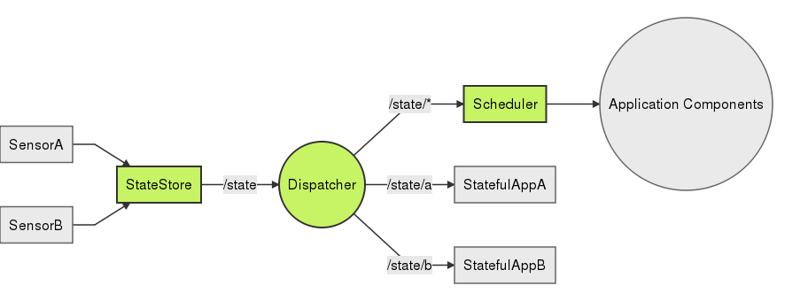

# Dux

> DANGER: Novice at work! Incomplete nonsense.

Dux is an architecture for distributed systems inspired by [Flux](https://facebook.github.io/flux/). Dux is both a design and a reference implementation. The reference implementation uses [Docker](https://www.docker.com/) as it's component model. 

In Dux, a **component** is an isolated bucket of bits; our building block. A **service** is a logical unit of one or more components. Expect these terms to be used inconsistently with their definition. 

Check out the [dux-quickstart](https://github.com/asbjornenge/dux-quickstart) guide to get started.

## Core Services 

At it's core Dux has a **StateStore**, a **Dispatcher** and a **Scheduler**.

There is no technical distinction between Dux components and application components, they are all made from the same mold. It is important to note that while these services drive Dux itself, they are also intended for use by your applications. 

### StateStore

The [StateStore](https://github.com/asbjornenge/dux-statestore) is a fundamental part of Dux. It declaratively holds the state for your services. Whenever some state changes the StateStore will publish the updated state via the Dispatcher. Any subscribing components will be notified with the updated state. The StateStore also has a restful http api to allow new components request any current state.

With a nice UI on top, the StateStore can serve as a editable configuration store for your cluster.

Examples of state:

* Hosts
* Containers
* DNS
* Secrets
* Service Configuration

### Dispatcher

The [Dispatcher](https://github.com/asbjornenge/dux-dispatcher) is responsible for distributing messages from publishers to subscribers. Any component can act as publisher or subscriber to any message channel. Messages will be broadcast to all subscribes of that channel. This flexibility allows the system to grow dynamically.

If you are familiar with Flux, you will notice that the dispatcher is somewhat reversed in Dux. In Flux there are multiple Stores that needs to be informed about Actions, and the Dispatcher is what notifies all the stores. In Dux however we have a single StateStore. Hence the Dispatcher serves more as an event emitter, notifying all the listening services about changes in state. Updates to state are made directly to the StateStore.

### Scheduler

The [Scheduler](https://github.com/asbjornenge/dux-scheduler) is responsible for managing components. It gets a list of *components* and *hosts* from the StateStore and makes decisions about where to run those components. It can both add and remove components.

## Sensors

A Sensor is a naming convention for components that feed information back to the StateStore. 

They are defined as a special component type for a single, but very important reason; It is important to be aware that components updating the StateStore should **NOT** consume the same state as they are updating. This could lead to cyclic loops throwing an entire cluster into the abyss. There is nothing in Dux preventing you from creating cycles, so it is important to be aware of this fact. As a rule you should always structure your Dux applications as a [DAG](http://en.wikipedia.org/wiki/Directed_acyclic_graph).

## Monitoring Example (coming)

Provide links to Dux ref. impl of monitoring instead of overloading this document...
